# Architecture & Flow Diagrams

Visual companions to [ARCHITECTURE.md](ARCHITECTURE.md). All diagrams are
Mermaid — GitHub renders them inline. Numbers quoted (test counts, tolerances)
are reproduced from a clean build and match the top-level `README.md`.

---

## 1. The portfolio at a glance — areas, asset classes, languages

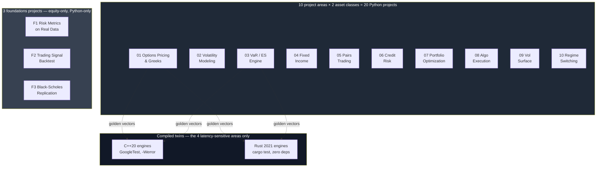

Why areas 1 and 3 specifically get compiled twins, not the other eight: see
[ARCHITECTURE.md](ARCHITECTURE.md) "Why only these four get compiled twins."

---

## 2. Cross-language golden-vector validation pipeline

The technical backbone of the whole portfolio — how a Python-computed number
becomes a pinned test assertion in two other languages.

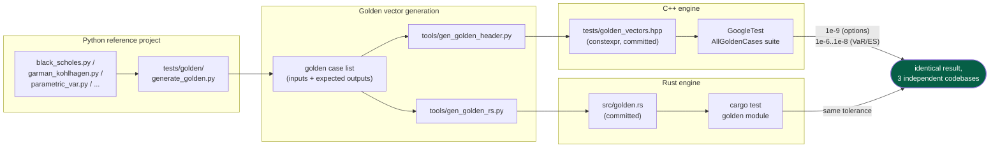

**What this proves**: the C++ and Rust engines compute the *same numbers* as
the Python reference for every pinned case, to floating-point-noise tolerance.
**What it does not prove**: that the Python reference itself is correct — that
burden is carried by each project's own analytic-identity and convergence
tests (put-call parity, Greeks-vs-finite-difference, tree→BS convergence),
not by cross-language agreement. Two wrong implementations that made the same
mistake would still agree with each other.

---

## 3. Per-area data flow — Options Pricing & Greeks (areas 01/01)

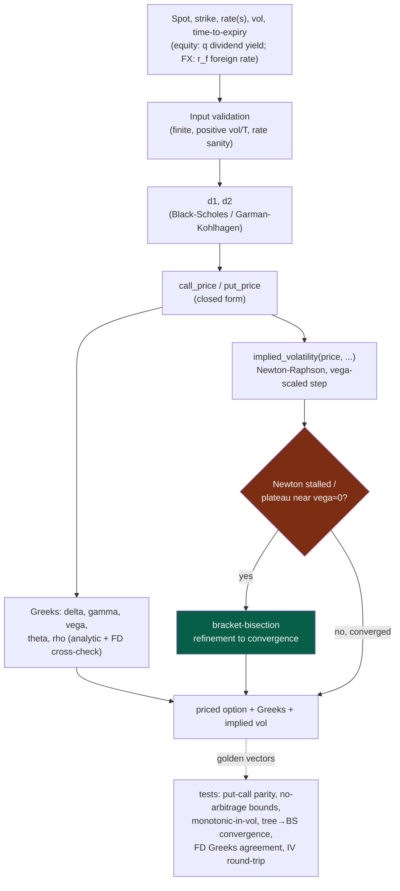

The `STALL` branch is the fix from the deep-rigor review pass: all six
options engines (Python/C++/Rust × equity/FX) used to exit as soon as the
Newton residual stopped improving, which silently lost precision (or, in the
FX engines, saturated at the no-arbitrage bound and returned a vol that did
not actually reprice the input) near flat-vega regions. See Round 3 in
[LEARN.md](LEARN.md) and diagram 9 below.

---

## 4. Per-area data flow — Market Risk VaR / Expected Shortfall (areas 03/03)

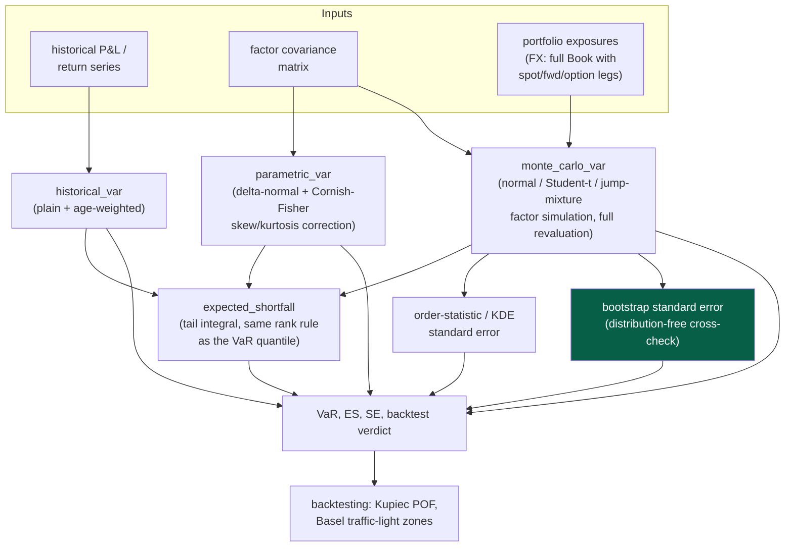

`SE2` (bootstrap standard error) was added to all four Monte Carlo VaR engines
(equity/FX × C++/Rust) in the deep-rigor review pass specifically because
`SE1`'s local density estimate systematically underestimates the true
sampling error by 9-17% at deep tails or modest scenario counts — see
Round 7 in [LEARN.md](LEARN.md).

---

## 5. Per-area data flow — Volatility Surface & Stochastic Vol (areas 09/09)

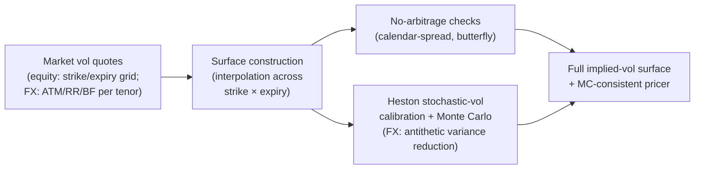

---

## 6. Per-area data flow — Portfolio Optimization & Risk Allocation (areas 07/07)

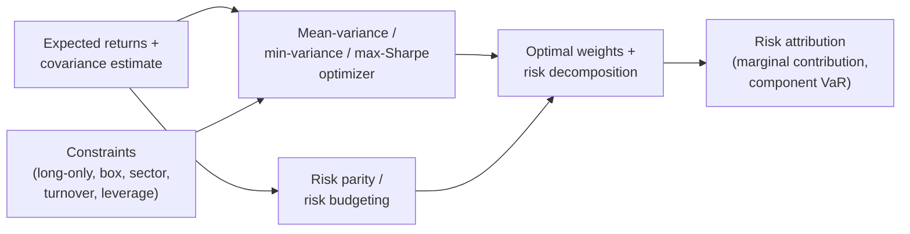

---

## 7. Per-area data flow — Algorithmic Trading & Execution (areas 08/08)

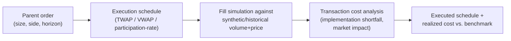

---

## 8. Per-area data flow — Regime-Switching Strategy (areas 10/10)

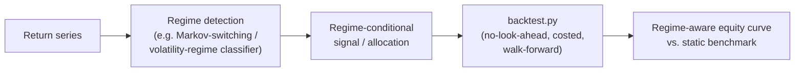

---

## 9. The NaN-guard defect class — and how it was found and fixed

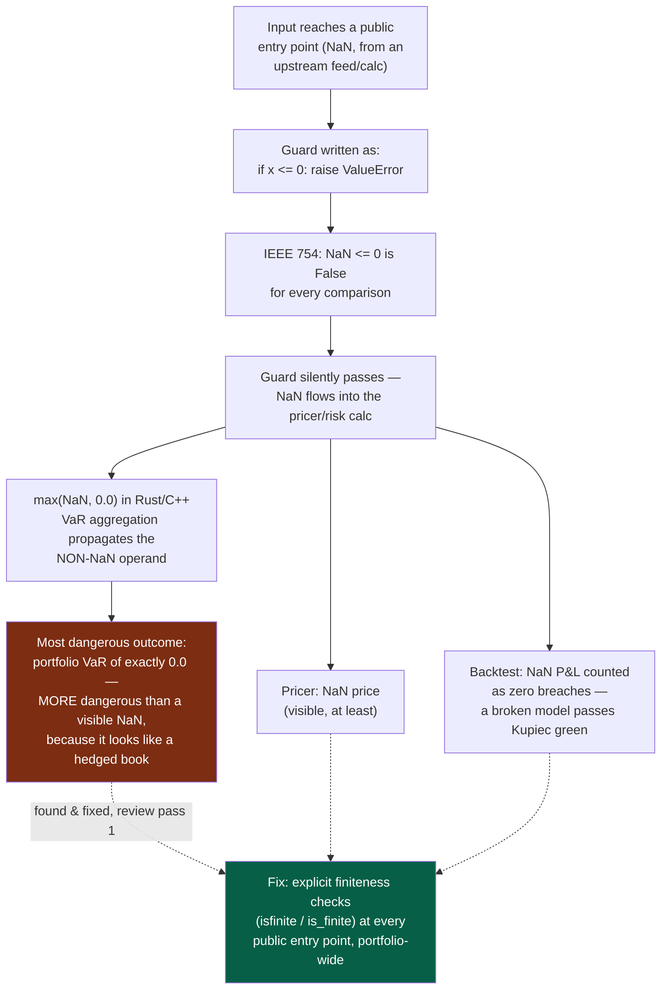

---

## 10. Anatomy of the implied-vol solver fix (all six options engines)

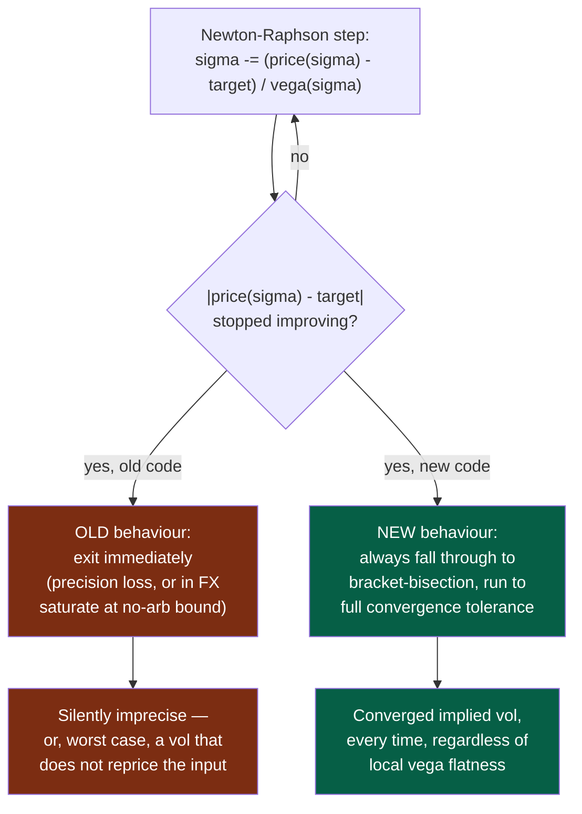

No golden-vector value changed as a result of this fix — it is a robustness
correction to how the solver behaves near flat vega, not to the pricing
formula the golden vectors pin. Full write-up: Round 3 in
[LEARN.md](LEARN.md).

---

## 11. Anatomy of the Cornish-Fisher grid-resolution fix (all six VaR/ES engines)

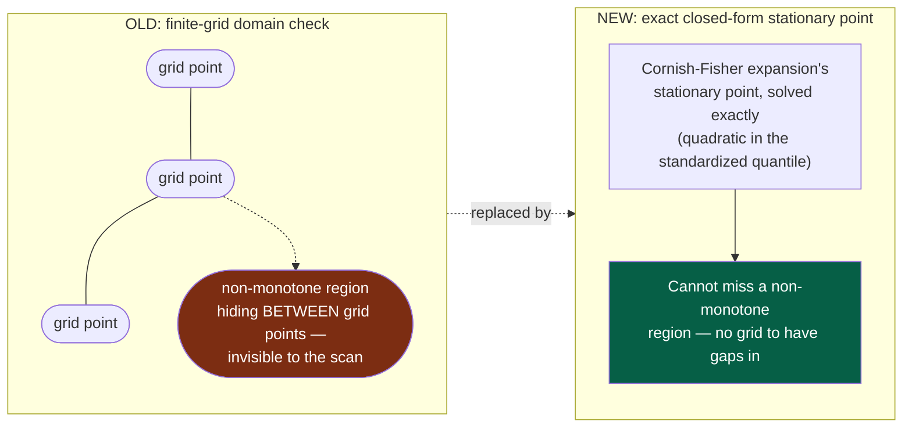

---

## 12. Testing & CI pipeline — how "5,963 tests, all passing" is produced

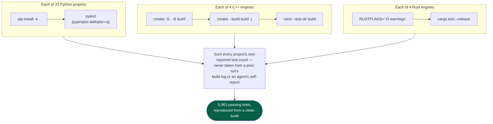

Sequential, not parallel/backgrounded, for the C++ builds specifically — two
`cmake --build` invocations sharing a build directory (or racing for CPU in a
resource-constrained CI runner) is its own failure mode independent of the
code being tested.

---

## 13. The full portfolio review history, in one line

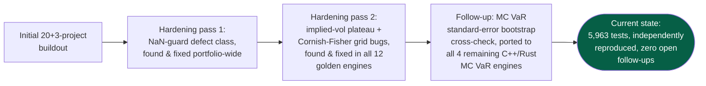

Every one of these passes is a teaching case study in
[LEARN.md](LEARN.md) Round 18 — what the bug actually was, why it survived
the first round of tests, and what kind of test would have caught it sooner.
